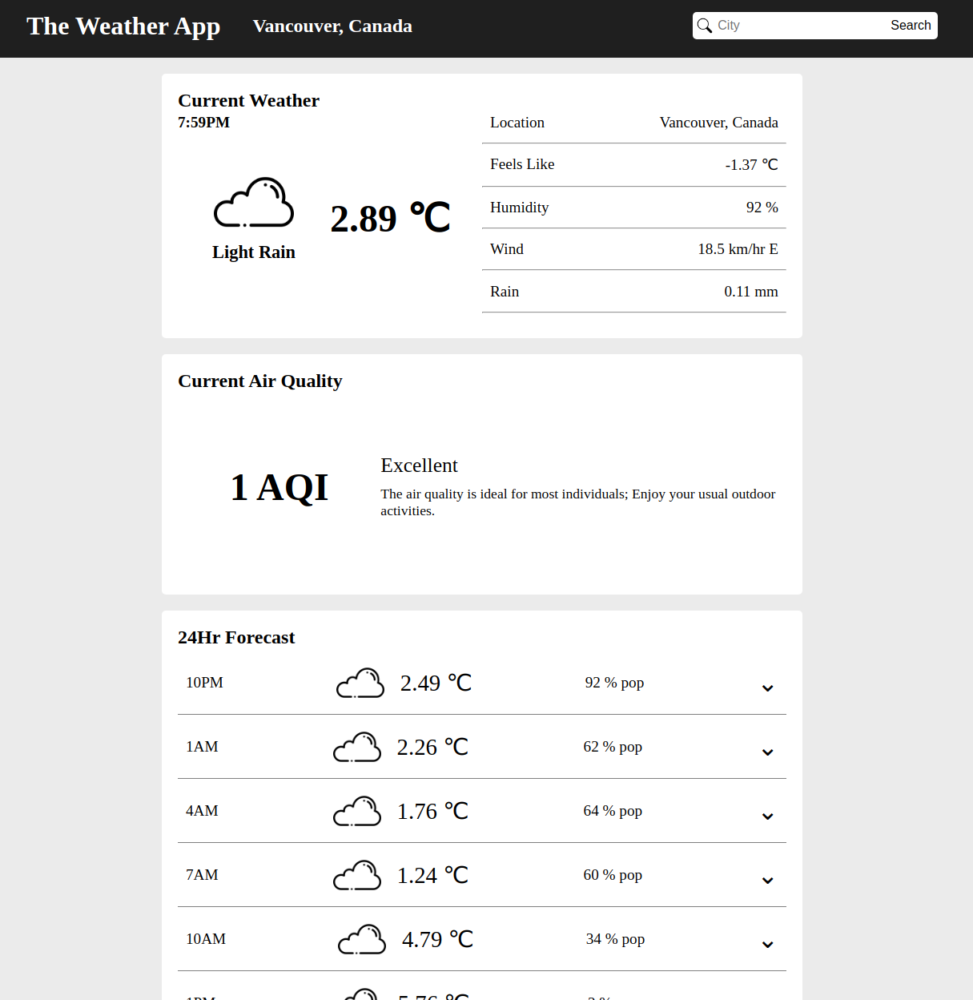

# Weather App

## About

A weather forecast site made using the open weather API to gather data for the searched city and display on the page.

## Topics Covered

-   Utilizing APIs and fetch
-   Promises
-   Async function and await

## TODO

-   Refactor weather objects
-   Add weather map
-   Update weather icon based on condition
-   Modify AQI and create visual representation
-   Add Daily Forecast
-   Add visual indication while waiting for API data
-   Add functionality to convert units
